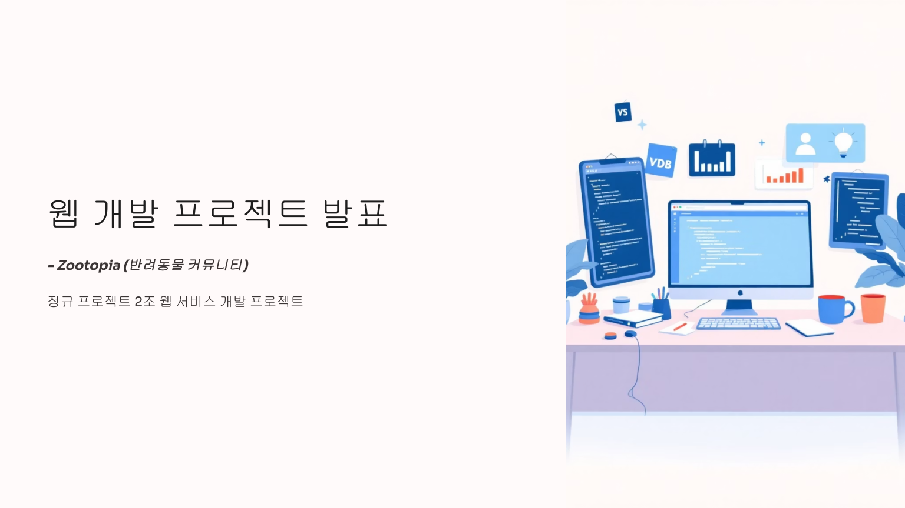

# 🐾 반려 동물 커뮤니티 - Zootopia
> 반려동물 커뮤니티 웹 애플리케이션

## 📋 프로젝트 개요

**프로젝트명**: ZOOTOPIA  
**개발 기간**: 2025.06.26 ~ 2025.07.22  
**수행 방식**: 팀 프로젝트  

### 기술 스택

## 🎯 주요 기능
 - 로그인 및 회원가입
 - 커뮤니티 (자유게시판, 자랑게시판, 유실동물게시판)
 - 카카오맵 Api 활용 지도 기반 검색
 - 추천 병원 정보
 - 펫 보험 정보
 - 펫 알바
 - 펫 스토어

## 📁 프로젝트 목표

Spring Boot, Thymeleaf 등을 이용해 사용자가 이해하기 쉬운 직관적인 UI, 자유게시판 등의 여러 기능들을 동물의 종류에 상관없이 모두 즐길 수 있는 커뮤니티

## 📸 스크린샷

  
⬇📑스크린샷 펼쳐보기⬇

 
| **메인 페이지** |
|------------|
|  |

| **회원가입** |
|------------|
|  |

| **로그인** |
|------------|
|  |

| **스토어** |
|------------|
|  |

| **내 주변 찾기** |
|------------|
|  |

| **펫 알바** |
|------------|
|  |

| **펫 보험** |
|------------|
|  |

| **추천 병원** |
|------------|
|  |

| **반려동물 장례정보** |
|------------|
|  |

| **게시판** |
|------------|
|  |

<a href="#-스크린샷">🔼 닫기 (맨 위로) - 위의 "📑 발표 자료 펼쳐보기" 버튼을 다시 누르면 닫힙니다 🔽</a>

   
## 👥 팀 구성 및 역할
신유식
- 추천 병원 및 반려동물 장례 페이지
- 헤더 메뉴 및 서브메뉴 수정 및 기능추가
- 소셜로그인 (네이버)

이윤태
- 보험 및 펫 아르바이트 페이지 개발
- 메인 페이지 개발
- CRUD 기반 백엔드 개발

전주원
- 카카오맵 api 활용하여 지도 페이지 개발
- CRUD 기반 커뮤니티 개발

홍성민
- 애완동물 관련 제품 구매 및 결제 페이지 개발
- CRUD  기반 백엔드 개발

### 반려 동물 커뮤니티 - ZOOTOPIA
[PPT 슬라이드 쇼](https://yoosik-shin.github.io/AI3_TEAM_ZOOTOPIA/)

## 슬라이드 펼쳐보기

  
📑 발표 자료 펼쳐보기

  
  
  
  
  
  
  
  
  
  
  
  
  
  
  
  
  
  
  

